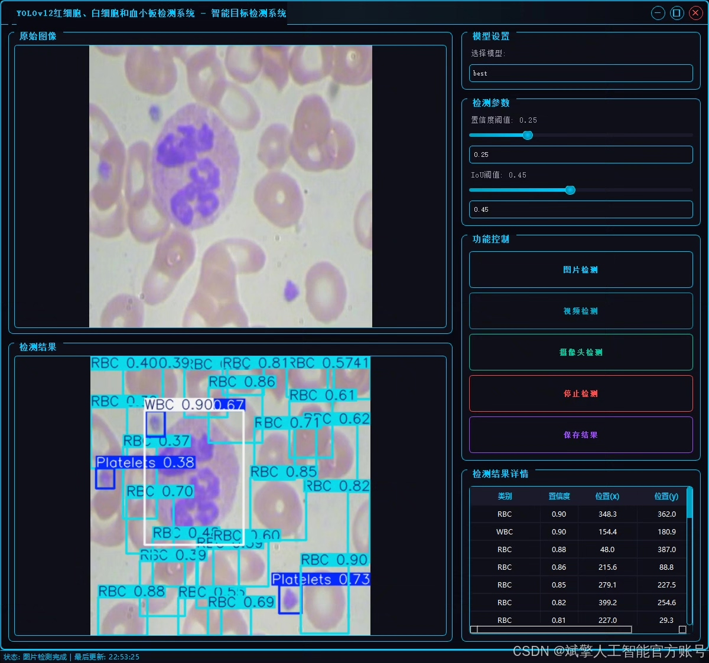
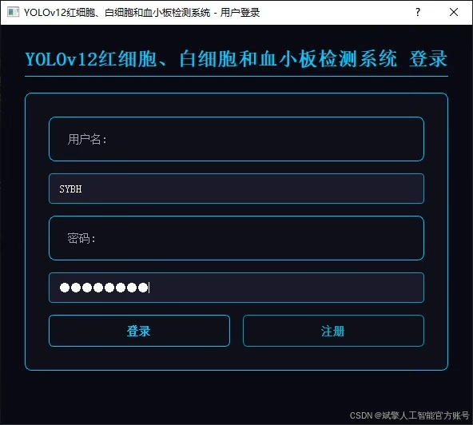
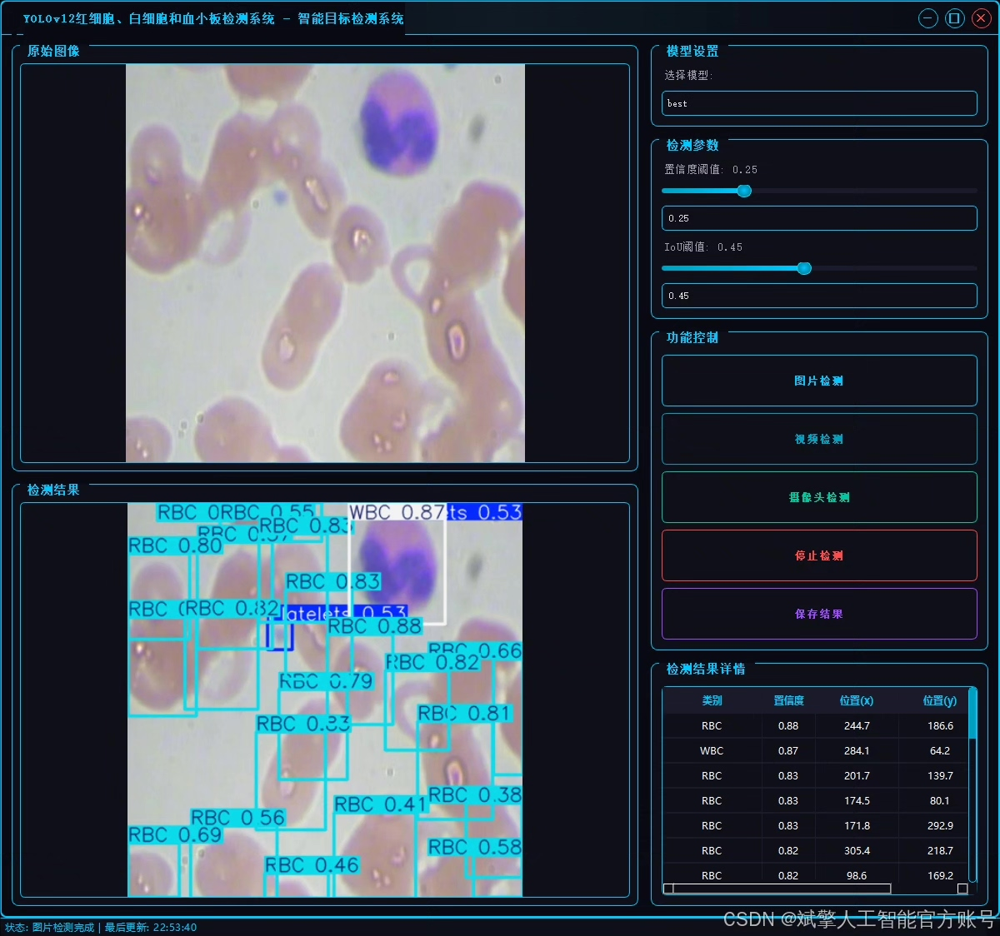
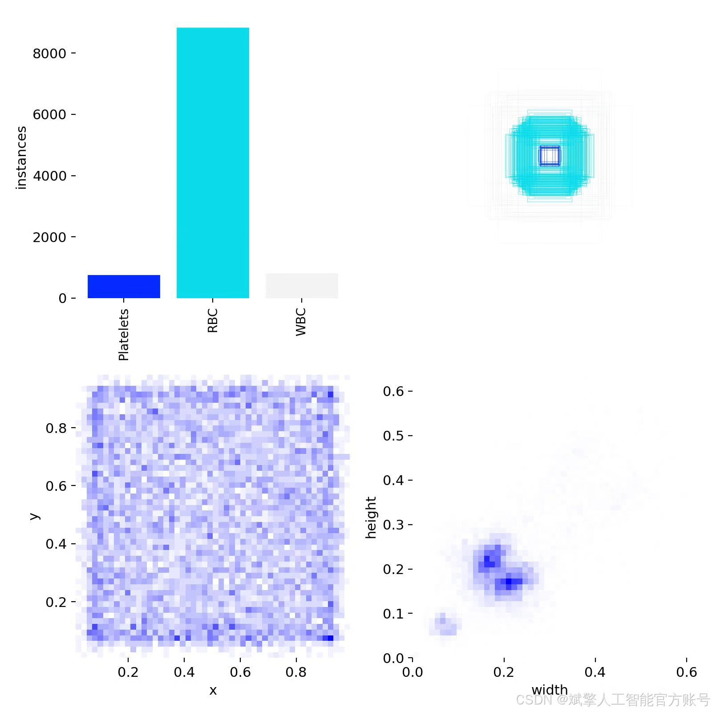
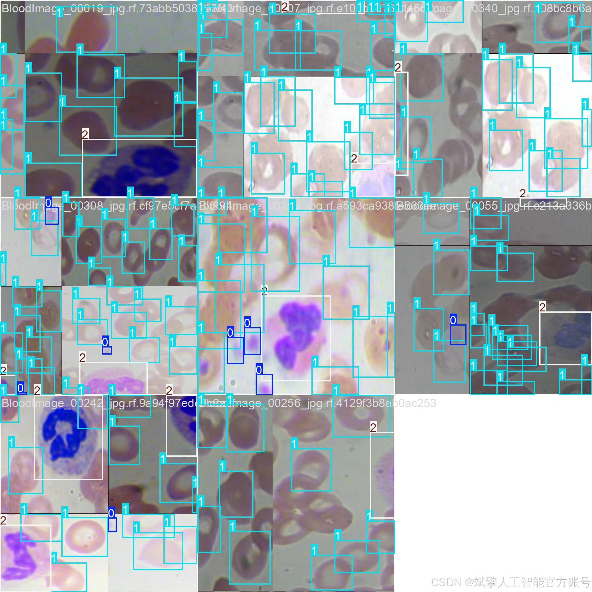
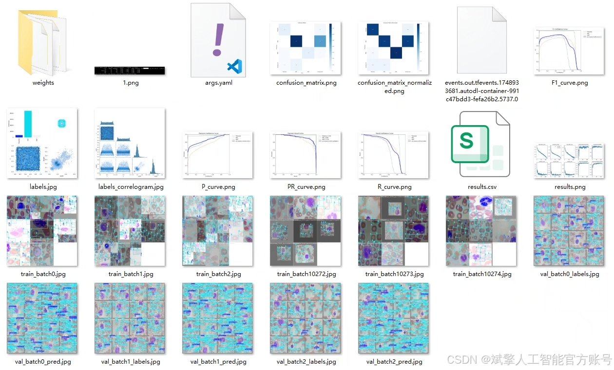
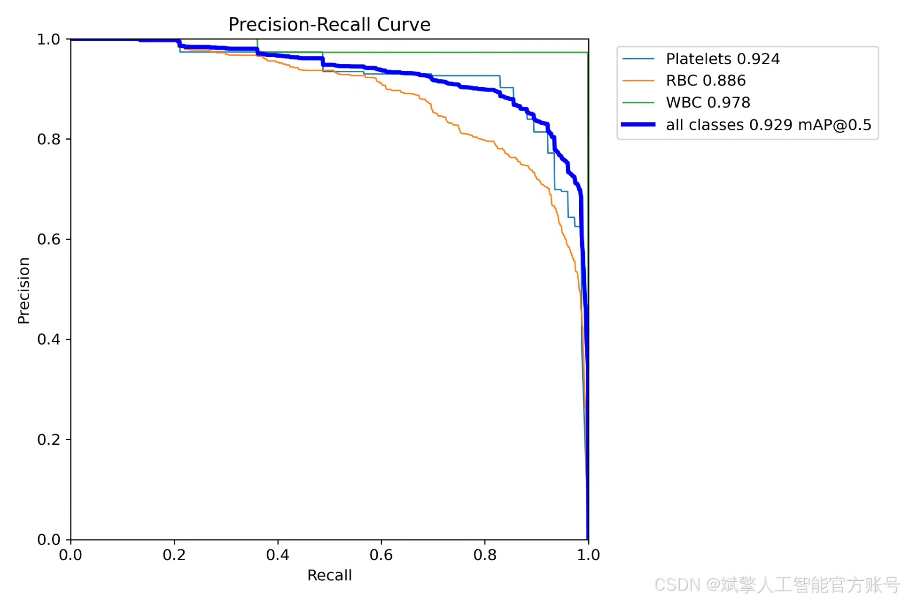
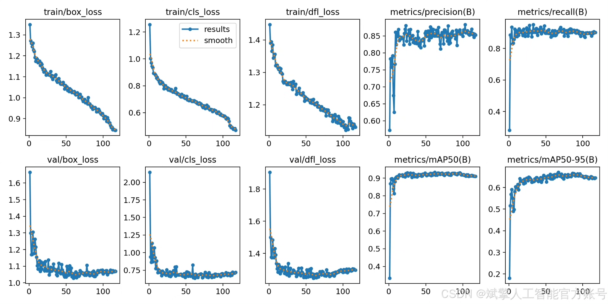
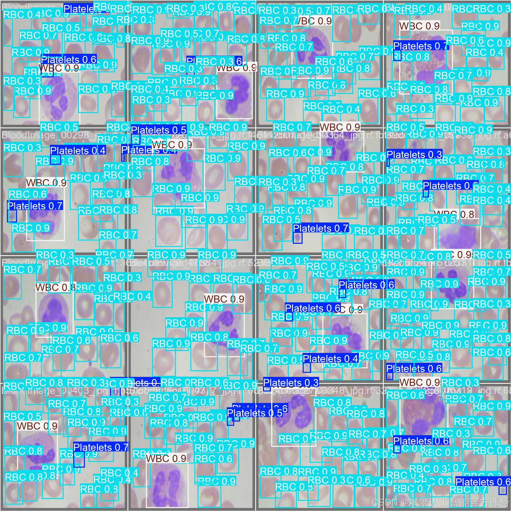

# YOLOv12 Blood Cell Detection System

## Body

YOLOv12 Blood Cell Detection System Based on Deep Learning YOLOv12: A system for the automatic recognition and classification of red blood cells (RBC), white blood cells (WBC), and platelets (Platelets) in blood samples using the YOLOv12 deep learning algorithm.

This project has developed an intelligent blood cell detection system based on the YOLOv12 deep learning algorithm, capable of automatically recognizing and classifying red blood cells (RBC), white blood cells (WBC), and platelets (Platelets) in blood samples. The system utilizes a professional dataset containing 874 labeled images (765 training images, 73 validation images, and 36 test images) for model training, achieving precise detection of the three types of blood cells. The project provides a complete Python implementation plan, including the optimized YOLOv12 model, a user-friendly UI interface, and secure login registration features. The system displays the detection results through an intuitive visualization interface, which can be widely applied in hospital laboratories and medical laboratories, significantly enhancing the efficiency and accuracy of blood cell detection, providing an intelligent assistant tool for the diagnosis of blood diseases. The entire solution includes trained model weights, complete project source code, and detailed deployment guides.

✅ User Login and Registration: Supports password verification and security validation.
✅ Three Detection Modes: Based on the YOLOv12 model, supports image, video, and real-time camera detection, accurately identifying targets.
✅ Dual-Screen Comparison: Displays the original image and detection results simultaneously on the screen.
✅ Data Visualization: Real-time table displaying the category, confidence, and coordinates of detected targets.
✅ Intelligent Parameter Tuning: Offers a confidence slide bar to dynamically optimize detection accuracy, adapting to different scene requirements.
✅ Sci-Fi Style Interactive Interface: Dark theme paired with dynamic light effects, reducing visual fatigue and improving operational experience.

## Images

## Payment

Here is a pay link on Stripe ( https://buy.stripe.com/3cs8yP7sY87d0vu9AB ). Please contact me lonlonago@foxmail.com after funding $89, and I will send you a complete data files , thank you!

